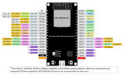
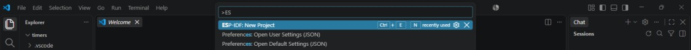
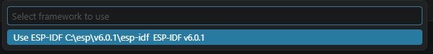
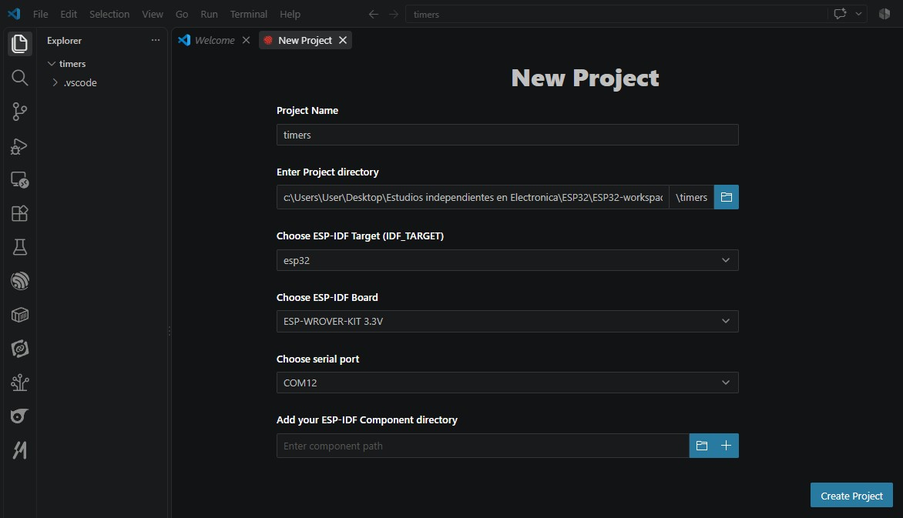
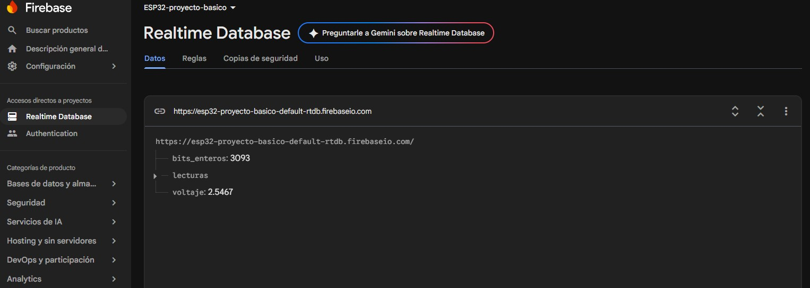

# ESP32 ESP-IDF

Proyectos realizados en ESP-IDF con VSCode.

## Pinout ESP32

## Configuracion de proyectos
En VSCode utilizando Ctrl+Shift+P o colocando ">" en linea de comandos superior iniciar un proyecto nuevo con
ENew Proyect

 
Indicar la version de ESP-IDF a utilizar: 

 
Indicar ubicacion de carpeta y puerto COM: 

 

Al armar un nuevo proyecto si no reconoce los includes (.h) es posible que el proyecto requiera reestructuración de CMake.
 

## PWM (Pulse Width Modulation)

## Firebase
 
Este ejercicio no fue realizado con ESP-IDF sino con código .ino para enviar lectura de un potenciometro a base de datos Firebase.

 
